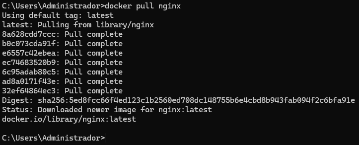
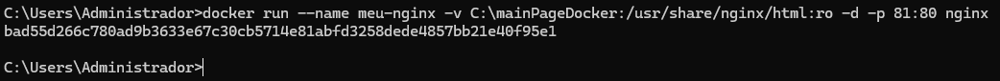

# 🚀 Lista de exercicio sobre Docker!

**Objetivo**: Realizar a lista de exercício disponibilizada e colocar prints e comandos para evidenciar a realizacao da mesma.

## 📋 Sumário
- [Fácil](#-facil)
  - [1. Rodando um container básico](#1-facil)
  - [2. Criando e rodando um container interativo](#2-facil)
  - [3. Listando e removendo containers](#3-facil)
  - [4. Criando um Dockerfile para uma aplicação simples em Python](#4-facil)
-[Médio](#-medio)
  - [5. Criando e utilizando volumes para persistência de dados](#5-medio)

## 🔧 Exercícios

### 1. Rodando um container básico
**Execute um container usando a imagem do Nginx e acesse a página padrão no 
navegador. Use a landing page do TailwindCSS como site estático dentro do 
container.**:  

- Primeiramente vamos pegar imagem do Nginx do DockerHub  
- Depois iremos executar o comando `docker run --name meu-nginx -v [seudiretorio]:/usr/share/nginx/html -d -p 81:80 nginx` que sobe o container do Nginx e copia o diretorio da landing page do TailwindCSS pro diretorio onde o Nginx busca o arquivo index.html e faz a conexao entre a porta do host e do container.

### 2. Criando e rodando um container interativo
**Inicie um container Ubuntu e interaja com o terminal dele. Teste um script Bash que 
imprime logs do sistema ou instala pacotes de forma interativa.**:  
- Primeiramente vamos pegar imagem do Nginx do DockerHub

### 3. Listando e removendo containers
**Inicie um container Ubuntu e interaja com o terminal dele. Teste um script Bash que 
imprime logs do sistema ou instala pacotes de forma interativa.**: 

### 4. Criando um Dockerfile para uma aplicação simples em Python
**Inicie um container Ubuntu e interaja com o terminal dele. Teste um script Bash que 
imprime logs do sistema ou instala pacotes de forma interativa.**: 

### 5. Criando e utilizando volumes para persistência de dados
```yaml
services:
  backend:
    build: ./backend
    ports:
      - "80:80"
    environment:
      - DATABASE_DB=example
      - DATABASE_USER=root
      - DATABASE_PASSWORD=/run/secrets/db-password  
      - DATABASE_HOST=db
    depends_on:
      - db
    secrets:
      - db-password

  db:
    image: mysql:8.0.27
    environment:
      - MYSQL_DATABASE=example
      - MYSQL_ROOT_PASSWORD_FILE=/run/secrets/db-password  
    volumes:
      - db-data:/var/lib/mysql  
    secrets:
      - db-password

  frontend:
    build: ./frontend
    ports:
      - "3000:3000"
    depends_on:
      - backend

volumes:
  db-data:
secrets:
  db-password:
    file: db/password.txt
```
### 6. Criando e rodando um container multi-stage
```Dockerfile
FROM golang:1.19 AS build-stage

WORKDIR /app

COPY go.mod go.sum ./
RUN go mod download

COPY *.go ./

RUN CGO_ENABLED=0 GOOS=linux go build -o /docker-gs-ping

FROM gcr.io/distroless/base-debian11 AS build-release-stage

WORKDIR /

COPY --from=build-stage /docker-gs-ping /docker-gs-ping

EXPOSE 8080

USER nonroot:nonroot

ENTRYPOINT ["/docker-gs-ping"]
```