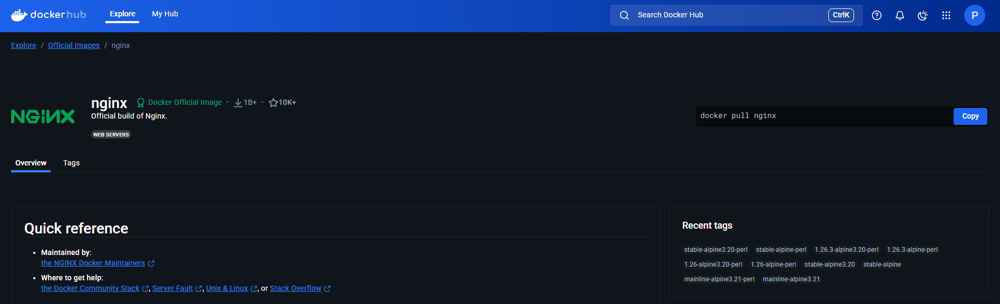

# 🚀 Lista de exercicio sobre Docker!

**Objetivo**: Realizar a lista de exercício disponibilizada e colocar prints e comandos para evidenciar a realizacao da mesma.

## 📋 Sumário
- [Fácil](#-facil)
  - [1. Rodando um container básico](#1-facil)
  - [2. Criando e rodando um container interativo](#2-facil)
  - [3. Listando e removendo containers](#3-facil)
  - [4. Criando um Dockerfile para uma aplicação simples em Python](#4-facil)

## 🔧 Exercícios

### 1. Rodando um container básico
**Execute um container usando a imagem do Nginx e acesse a página padrão no 
navegador. Use a landing page do TailwindCSS como site estático dentro do 
container.**:  

- Primeiramente vamos pegar imagem do Nginx do DockerHub  (img)
- Depois iremos executar o comando (cmd) que sobe o container do Nginx e copia o diretorio da landing page do TailwindCSS pro diretorio onde o Nginx busca o arquivo index.html e faz a conexao entre a porta do host e do container.(img)(img)  
