# 🚀 Lista de exercicio sobre Docker!

**Objetivo**: Realizar a lista de exercício disponibilizada e colocar prints e comandos para evidenciar a realizacao da mesma.

## 📋 Sumário
- [Fácil](#-facil)
  - [1. Rodando um container básico](#1-facil)
  - [2. Criando e rodando um container interativo](#2-facil)
  - [3. Listando e removendo containers](#3-facil)
  - [4. Criando um Dockerfile para uma aplicação simples em Python](#4-facil)
- [Médio](#-medio)
  - [5. Criando e utilizando volumes para persistência de dados](#5-medio)
  - [6. Criando e rodando um container multi-stage](#6-medio)
  - [7. Construindo uma rede Docker para comunicação entre containers](#7-medio)
  - [8. Criando um compose file para rodar uma aplicação com banco de dados](#8-medio)
- [Difícil](#-dificil)
  - [9. Criando uma imagem personalizada com um servidor web e arquivos estáticos](#9-dificil)
  - [10. Evitar execução como root](#10-dificil)
  - [11. Analisar imagem Docker com Trivy](#11-dificil)
  - [12. Corrigir vulnerabilidades encontradas](#12-dificil)

## 🔧 Exercícios

### 1. Rodando um container básico
**Execute um container usando a imagem do Nginx e acesse a página padrão no 
navegador. Use a landing page do TailwindCSS como site estático dentro do 
container.**:  

- Primeiramente vamos pegar imagem do Nginx do DockerHub  
- Depois iremos executar o comando `docker run --name meu-nginx -v [seudiretorio]:/usr/share/nginx/html -d -p 81:80 nginx` que sobe o container do Nginx e copia o diretorio da landing page do TailwindCSS pro diretorio onde o Nginx busca o arquivo index.html e faz a conexao entre a porta do host e do container.

### 2. Criando e rodando um container interativo
**Inicie um container Ubuntu e interaja com o terminal dele. Teste um script Bash que
imprime logs do sistema ou instala pacotes de forma interativa**:  
- Primeiramente vamos pegar imagem do Nginx do DockerHub

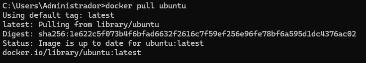
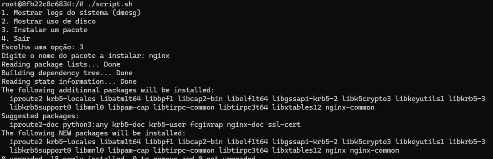
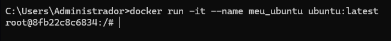
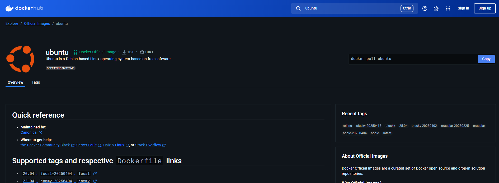

### 3. Listando e removendo containers
**Liste todos os containers em execução e parados, pare um container em execução e
remova um container específico**:

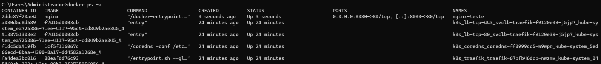
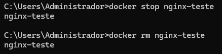
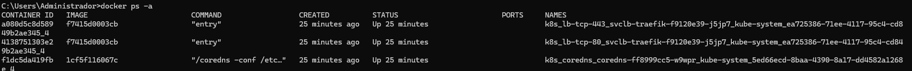

### 4. Criando um Dockerfile para uma aplicação simples em Python
**Crie um Dockerfile para uma aplicação Flask que retorna uma mensagem ao acessar
um endpoint, para isso utilize o projeto Docker Flask**: 

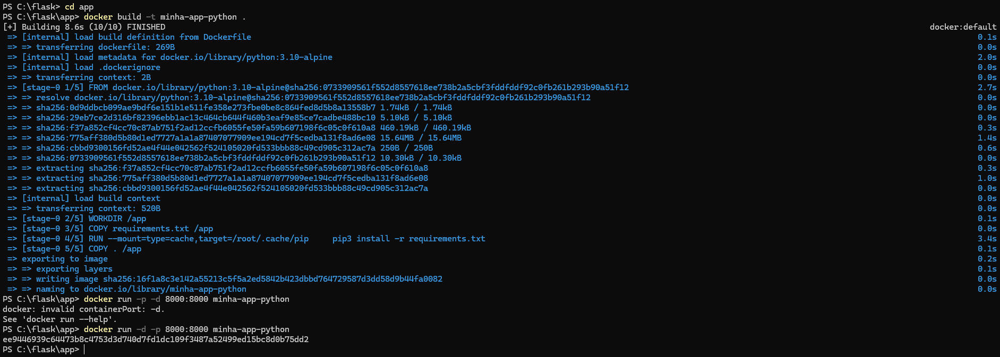
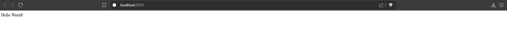
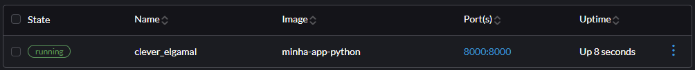

### 5. Criando e utilizando volumes para persistência de dados
**Execute um container MySQL e configure um volume para armazenar os dados do
banco de forma persistente. Para aplicar esse conceito você pode utilizar o reactexpress-mysql**:
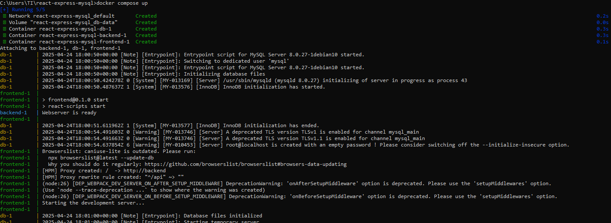
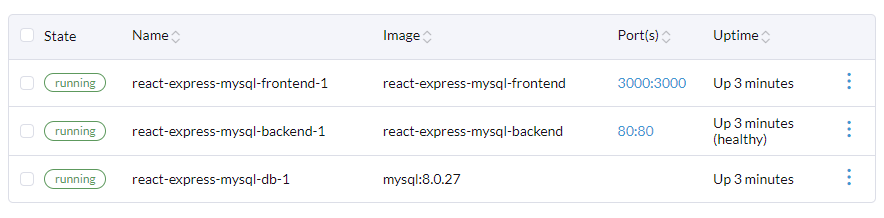
```yaml
services:
  backend:
    build: ./backend
    ports:
      - "80:80"
    environment:
      - DATABASE_DB=example
      - DATABASE_USER=root
      - DATABASE_PASSWORD=/run/secrets/db-password  
      - DATABASE_HOST=db
    depends_on:
      - db
    secrets:
      - db-password

  db:
    image: mysql:8.0.27
    environment:
      - MYSQL_DATABASE=example
      - MYSQL_ROOT_PASSWORD_FILE=/run/secrets/db-password  
    volumes:
      - db-data:/var/lib/mysql  
    secrets:
      - db-password

  frontend:
    build: ./frontend
    ports:
      - "3000:3000"
    depends_on:
      - backend

volumes:
  db-data:
secrets:
  db-password:
    file: db/password.txt
```
### 6. Criando e rodando um container multi-stage
**Crie uma rede Docker personalizada e faça dois containers, um Node.js e um
MongoDB, se comunicarem, sugestão, utilize o projeto React Express + Mongo**:

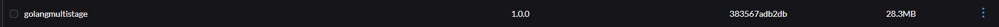
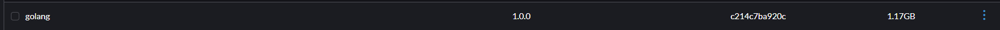
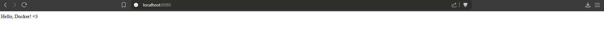
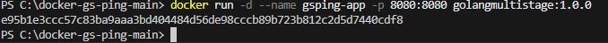

```Dockerfile
FROM golang:1.19 AS build-stage

WORKDIR /app

COPY go.mod go.sum ./
RUN go mod download

COPY *.go ./

RUN CGO_ENABLED=0 GOOS=linux go build -o /docker-gs-ping

FROM gcr.io/distroless/base-debian11 AS build-release-stage

WORKDIR /

COPY --from=build-stage /docker-gs-ping /docker-gs-ping

EXPOSE 8080

USER nonroot:nonroot

ENTRYPOINT ["/docker-gs-ping"]
```
### 7. Construindo uma rede Docker para comunicação entre containers
**Crie uma rede Docker personalizada e faça dois containers, um Node.js e um
MongoDB, se comunicarem, sugestão, utilize o projeto React Express + Mongo**:

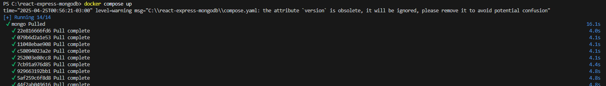
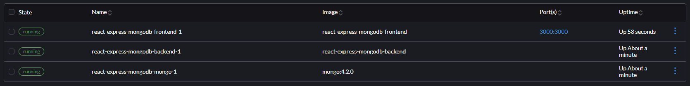
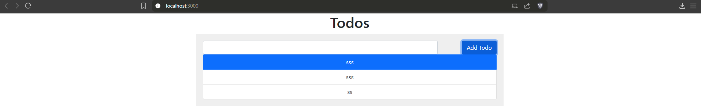

```yaml
services:
  frontend:
    build: ./frontend
    ports:
      - "3000:3000"
    volumes:
      - ./frontend:/usr/src/app
      - /usr/src/app/node_modules
    depends_on:
      - backend
    networks:
      - app-network

  backend:
    build: ./backend
    volumes:
      - ./backend:/usr/src/app
      - /usr/src/app/node_modules
    environment:
      - MONGO_URL=mongodb://mongo:27017/mydb
    depends_on:
      - mongo
    networks:
      - app-network

  mongo:
    image: mongo:4.2.0
    volumes:
      - mongo_data:/data/db
    networks:
      - app-network

networks:
  app-network:

volumes:
  mongo_data:
```
### 8. Criando um compose file para rodar uma aplicação com banco de dados
**Utilize Docker Compose para configurar uma aplicação com um banco de
dados PostgreSQL, use para isso o projeto pgadmin**:

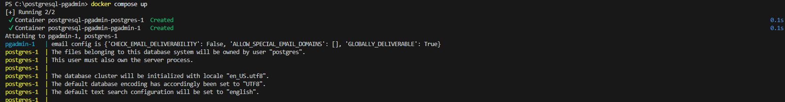
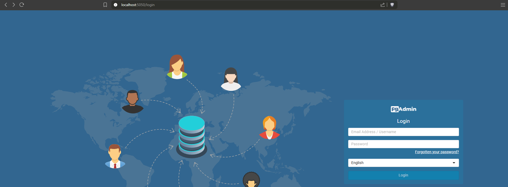
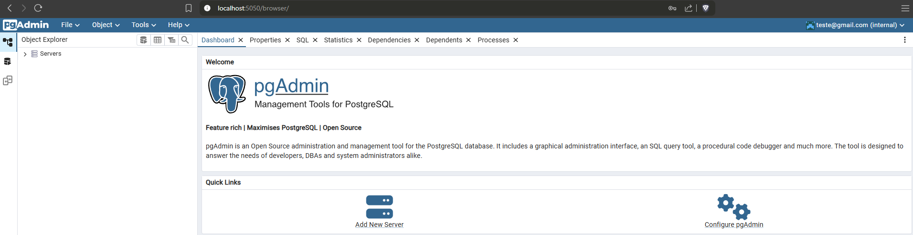
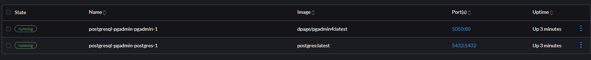

```yaml
services:
  postgres:
    image: postgres:latest
    environment:
      - POSTGRES_USER=root
      - POSTGRES_PASSWORD=pw23
      - POSTGRES_DB=db_base
    ports:
      - "5432:5432"

  pgadmin:
    image: dpage/pgadmin4:latest
    environment:
      - PGADMIN_DEFAULT_EMAIL=teste@gmail.com
      - PGADMIN_DEFAULT_PASSWORD=teste123
    ports:
      - "5050:80"
```
### 9. Criando uma imagem personalizada com um servidor web e arquivos estáticos
**Construa uma imagem baseada no Nginx ou Apache, adicionando um site
HTML/CSS estático. Utilize a landing page do Creative Tim para criar uma página
moderna hospedada no container**:


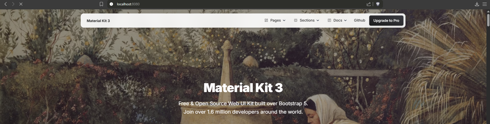
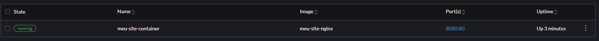

```Dockerfile
FROM nginx:alpine

COPY . /usr/share/nginx/html

EXPOSE 80

CMD ["nginx", "-g", "daemon off;"]
```
### 10. Evitar execução como root
**Ao rodar containers com o usuário root, você expõe seu sistema a riscos maiores em
caso de comprometimento. Neste exercício, você deverá criar um Dockerfile para
uma aplicação simples (como um script Python ou um servidor Node.js) e configurar
a imagem para rodar com um usuário não-root**:

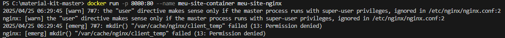
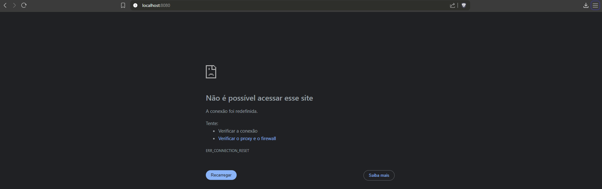
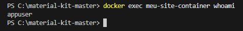

```Dockerfile
FROM nginx:alpine

COPY . /usr/share/nginx/html

EXPOSE 80

RUN adduser -D appuser && \
    chown -R appuser:appuser /usr/share/nginx/html

USER appuser

CMD ["sh", "-c", "nginx -g 'daemon off;' || sleep infinity"]
```
### 11. Analisar imagem Docker com Trivy
**Trivy é uma ferramenta open source para análise de vulnerabilidades em imagens
Docker. Neste exercício, você irá analisar uma imagem pública, como python:3.9 ou
node:16, em busca de vulnerabilidades conhecidas**:

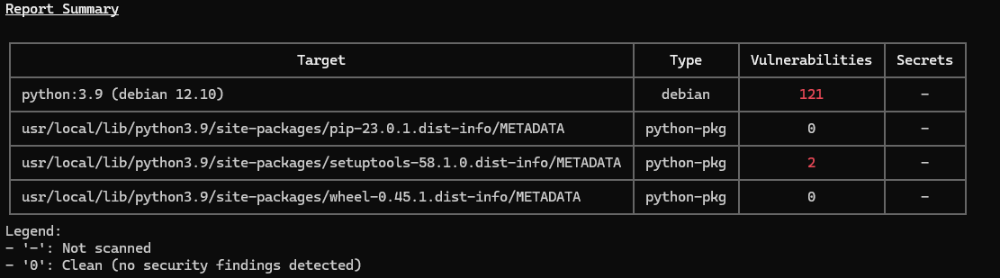
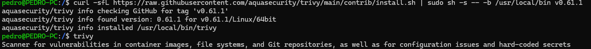

Bibliotecas do sistema (Debian):
libaom3
libbluetooth-dev
libbluetooth3
libexpat1
libexpat1-dev
libharfbuzz0b
libldap-2.5-0
libopenexr-3-1-30
libopenexr-dev
libperl5.36
libtiff-dev
libtiff6
libtiffxx6
libxml2
libxml2-dev
linux-libc-dev
perl
perl-base
perl-modules-5.36
zlib1g
zlib1g-dev

Bibliotecas Python:
setuptools (python-pkg)


atualizar as bibliotecas e dependências do sistema operacional pode ajudar a reduzir vulnerabilidades, outra solucao é trocar para um sistema operacional mais leve, como o Alpine, que tem menos dependências e, portanto, menos vulnerabilidades potenciais.
### 12. Corrigir vulnerabilidades encontradas
**Após identificar vulnerabilidades com ferramentas como o Trivy, o próximo passo é
corrigi-las. Imagens grandes e genéricas frequentemente trazem bibliotecas
desnecessárias e vulneráveis, além de usarem o usuário root por padrão. Neste
exercício, você irá trabalhar com um exemplo de Dockerfile com más práticas e
aplicar melhorias para construir uma imagem mais segura e enxuta. Identifique as
melhorias e gere uma nova versão de Dockerfile**:

```Dockerfile
FROM python:3.9-slim

RUN apt-get update && \
    apt-get upgrade -y 

RUN groupadd -r appuser && useradd -r -g appuser appuser

WORKDIR /app

COPY requirements.txt .

RUN pip install --no-cache-dir --upgrade pip && \
    pip install --no-cache-dir -r requirements.txt

COPY . .

RUN chown -R appuser:appuser /app
USER appuser

CMD ["python", "app.py"]
```

```
#atualize as dependencias
flask>=2.0.0
requests>=2.28.0
```

Substituí python:3.9 por python:3.9-slim que é uma versão mais enxuta e contém menos pacotes potencialmente vulneráveis
Criei um usuário dedicado appuser para executar a aplicação
Atualizei o pip antes de instalar as dependências
Adicionei apt-get update && apt-get upgrade -y para garantir que todos os pacotes do sistema estejam atualizados
